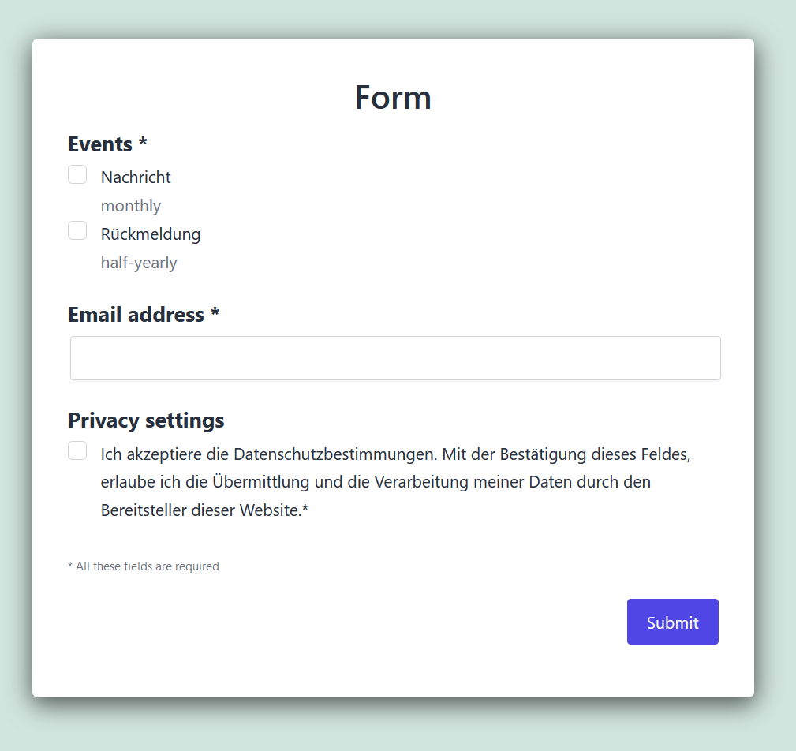
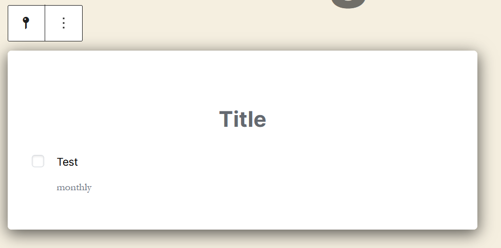

# Gutenberg Block

Damit sich Ihre Kunden auf für Ihre Erinnerungen anmelden können, brauchen wir noch ein Anmeldeformular,
welches Sie auf Ihrer Seite platzieren können. In diesem Anmeldeformular kann ein Kunde seine gewünschten Ereignisse
auswählen. Nach der Eingabe der E-Mail-Adresse und der Bestätigung der Datenschutzbestimmungen, steht der Anmeldung nichts mehr im Weg.

Dieses Formular können Sie ganz einfach mit einem Block in Ihrem Gutenberg-Editor erstellen. 
Aber auch die Möglichkeit das Formular mittels [Shortcode](shortcode.md) zu erstellen, steht Ihnen zur Verfügung.

### Wie erstelle ich ein Anmeldeformular auf einer Seite/in einem Beitrag?

Öffnen Sie dazu die gewünschte Seite/Beitrag in Ihrem WordPress-Backend. An der gewünschten
Stelle fügen Sie einen neuen Block hinzu (mittels dem `+` Button). In der Suche geben Sie nun `WPReminder` ein
und der `WPReminder Block` wird Ihnen angezeigt. Mit einem Klick darauf wird Ihnen dieser direkt in die 
Seite eingefügt.

Hier können Sie nun den Titel des Anmeldeformulars einfügen und auswählen welche Ereignisse in diesem
Formular angeboten werden sollen.

Wenn Sie die Seite nun speichern und aufrufen, werden Sie das vollständige Anmeldeformular sehen können.