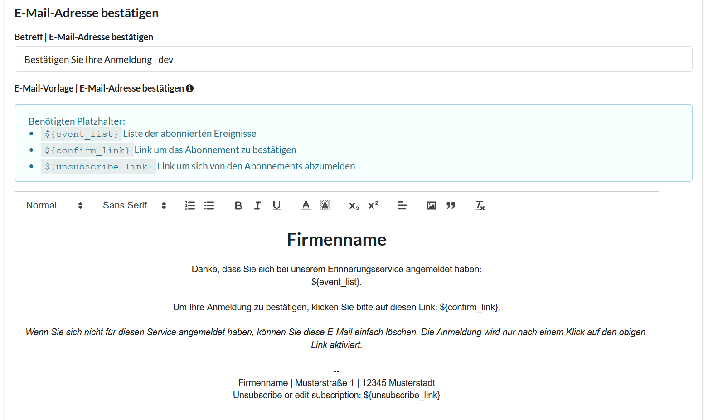

# E-Mail-Vorlagen

Bei der Anmeldung, Abmeldung und als Erinnerung versendet das Plugin an Ihre Kunden
automatisch erstelle E-Mails. Sie können (und sollten) diese Vorlagen anpassen, damit
Ihre Kunden auch genau erkennen können von wem sie die E-Mails erhalten haben.

Die E-Mail-Vorlagen können Sie unter `Reminder` => `Einstellungen` in Ihrem WordPress-Backend
finden. Unter dem Tab `Vorlagen` finden Sie die Vorlagen für vier verschiedene E-Mail-Adressen

### Vorlagen

!> Einige dieser Vorlagen benötigen sogenannte **Platzhalter** (erkennbar an diesen Klammern `${}`). Diese
dürfen nicht vergessen werden!

Die Vorlagen bestehen aus dem Betreff der versendeten E-Mail und dem E-Mail-Template.

#### Bestätigung

Nachdem sich einer Ihrer Kunden über das Anmeldeformular für ein oder mehrere Ereignisse registriert hat,
wird ihm diese E-Mail zugesendet. Sie können den Inhalten nach Ihren Wünschen gestalten und anpassen.
Vergessen Sie aber bitte nicht, dass diese 3 Platzhalter an den geeigneten Stellen erhalten sein müssen:

- `${event_list}`: Hier wird die Liste der abonnierten Ereignisse eingefügt und Ihrem Kunden angezeigt
- `${confirm_link}`: Hier wird ein Link zu Ihrer Seite eingesetzt. Mit einem Klick auf diesen Link bestätigt Ihr
Kunde seine Registrierung. Nur nach einem Klick auf diesen Link, ist der Kunde als `aktiv` markiert und kann Erinnerungen erhalten.
- `${unsubscribe_link}`: Hier wird ein Link zu Ihrer Seite eingesetzt. Mit einem Klick auf diesen Link kann der Kunde
sein Abonnement bearbeiten (Ereignisse hinzufügen oder entfernen) oder sein Abonnement beenden.
  

#### Registrierung abgeschlossen

Nachdem der Kunde in der Bestätigungs-E-Mail auf dem `${confirm_link}` geklickt hat, wird sein Abonnement aktiviert.
Diese Nachricht soll Ihrem Kunden genau das bestätigen. In dieser Vorlage ist nur ein Platzhalter nötig:

- `${unsubscribe_link}`: Hier wird ein Link zu Ihrer Seite eingesetzt. Mit einem Klick auf diesen Link kann der Kunde
  sein Abonnement bearbeiten (Ereignisse hinzufügen oder entfernen) oder sein Abonnement beenden.
  

#### Abmeldung

Sollte einer Ihre Kunden sich von Ihrem Erinnerungsservie abmelden, erhält er diese E-Mail als Bestätigung. 
Hier werden keine Platzhalter benötigt.

#### Erinnerung

Wenn sich ein Kunde erfolgreich für eines Ihrer Ereignisse angemeldet hat, erhält er zum Zeitpunkt des Ereignisses
diese E-Mail. Ihm werden dabei die Ereignisse aufgelistet, an welche er zu diesem Zeitpunkt erinnert werden wollte.
Erneut sind in dieser Vorlage Platzhalter für ein erfolgreiches Arbeiten notwendig:

- `${event_list}`: Hier werden die aktuellen Ereignisse angezeigt, an welche der Kunde zu diesem Zeitpunkt erinnert werden möchte.
- `${unsubscribe_link}`: Hier wird ein Link zu Ihrer Seite eingesetzt. Mit einem Klick auf diesen Link kann der Kunde
  sein Abonnement bearbeiten (Ereignisse hinzufügen oder entfernen) oder sein Abonnement beenden.