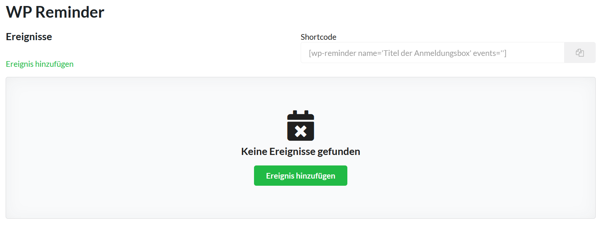
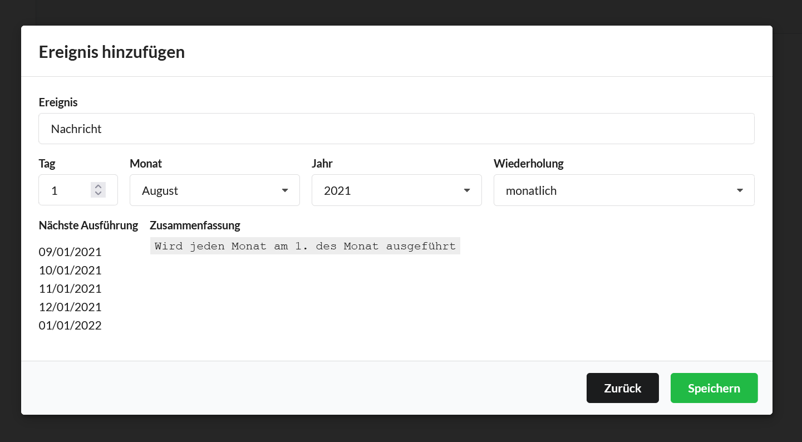
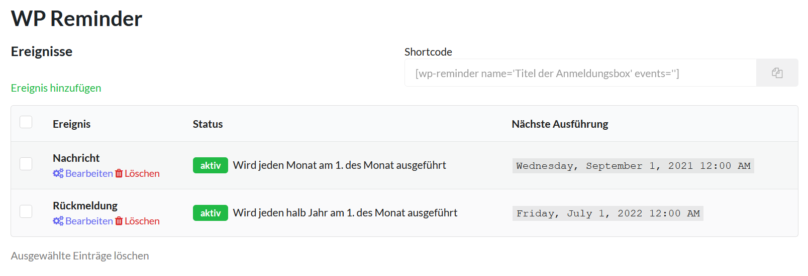

# Ein neues Ereignis erstellen

### Was ist ein Ereignis?

Mit RemindMe können Sie Ereignisse erstellen. Ein Ereignis hat 

- einen Namen 
- ein Startdatum und 
- eine Taktung

Ihre Kunden können sich für eines dieser Ereignisse anmelden und werden, sobald das Ereignis
stattfindet, per E-Mail daran erinnert. 

Mit dem Startdatum geben Sie an, wann das Ereignis zum ersten Mal ausgeführt werden soll:

**Beispiel**
> `1. Oktober`

Mit der Taktung legen Sie dann fest, wie das Ereignis wiederholt werden soll:

**Beispiel**

> `monatlich`

Damit werden die für dieses Ereignis angemeldeten Kunden an folgenden Tagen per E-Mail an das
Ereignis erinnert:

- 1. Oktober
- 1. November
- 1. Dezember
- 1. Januar
- ...    

### Wie lege ich ein Ereignis an?

Wenn Sie RemindMe installiert und aktiviert haben ([Installation](installation.md)), finden Sie
in ihrem Backend auf der Seitenleiste einen neuen Menüpunkt: `Reminder`. Im Untermenü von `Reminder` finden 
Sie den Punkt `Ereignisse`. Klicken Sie darauf.

Hier finden Sie aufgelistet Ihre bisher erstellen Ereignisse. Diese können Sie bearbeiten oder löschen.
Zudem können Sie aus ausgewählten Ereignissen auch einen [Shortcode](shortcode.md) erstellen, um diesen
als Anmeldeform zu nutzen.

Um ein Ereignis hinzuzufügen, klicken Sie auf `Ereignis hinzufügen`. Es öffnet sich ein neues
Fenster. Dort können Sie zuerst den Namen des Ereignisses angeben.

Geben Sie zusätzlich das Startdatum und die Taktung an. Die Taktung kann monatlich/jährlich eingestellt werden.
Ihnen werden sofort auch die Termine der nächsten Ausführungen und eine Zusammenfassung angezeigt.

Wenn Sie alle Informationen eingegeben haben, klicken sie auf `Speichern` und das Ereignis hinzuzufügen.

### Wie bearbeite oder lösche ich ein Ereignis?

Die erstellten Termine können Sie nun in der Übersicht betrachten. Hier haben Sie auch die Möglichkeit einzelne (oder mehrere)
Ereignise zu bearbeiten und zu löschen.