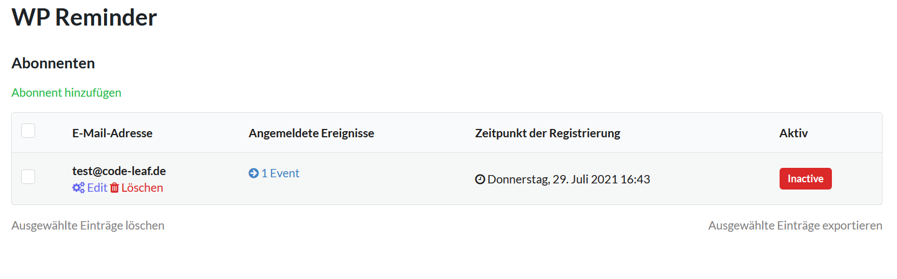
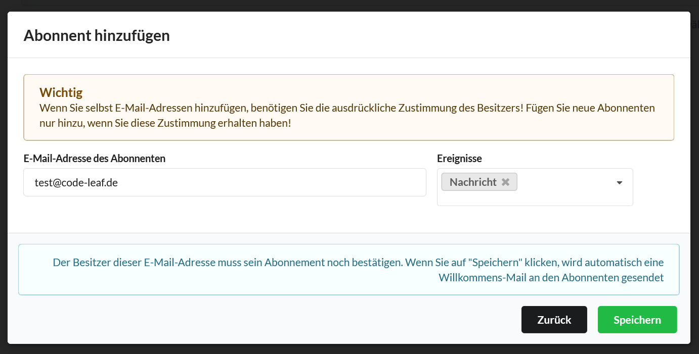

# Kunden anzeigen, bearbeiten und hinzufügen

?> Damit sich Ihre Kunden für die von Ihnen erstellen Ereignisse (siehe [Neues Ereignis erstellen](de-de/events.md))
anmelden können, müssen Sie auf Ihrer Seite ein Anmeldeformular erstellen. WPReminder nimmt Ihnen dabei fast alle 
Arbeit ab. Wie Sie ein Formular erstellen finden Sie unter [Gutenberg Block](de-de/block.md) oder unter [Shortcode](de-de/shortcode.md).

Wenn sich Ihre Kunden für eines oder mehrerer Ihrer Ereignisse angemeldet haben, finden Sie Informationen dazu
unter `Reminder` => `Abonnenten`.

### Wie bearbeite, lösche, exportiere oder füge ich neue Kunden hinzu?

!> Diese Funktion steht Ihnen nur mit einer gültigen Lizenz zur Verfügung. Mehr über Lizenzen erfahren 
Sie hier: [Lizenz](de-de/license.md).

Mit einem Klick auf `Abonnent hinzufügen` öffnet sich ein neues Fenster. Dort geben Sie die E-Mail-Adresse
Ihres Kunden ein und wählen die Ereignisse aus, für welche Sie diesen Kunden anmelden möchten.

!> **WICHTIG!** Fügen Sie nur E-Mail-Adressen von Kunden hinzu, von welchen Sie die ausdrückliche Zustimmung dazu haben.

Ihr Kunde wird dann zu Ihren Abonnenten hinzugefügt, verbleibt aber inaktiv (Erinnerungen werden nicht zugestellt). Der Kunde
hat zudem an die von Ihnen eingetragene E-Mail-Adresse eine E-Mail erhalten. In dieser muss er mit einem Klick die Aufnahme
zu den Ereignissen bestätigen (Double Opt-In). Nur wenn der Beisitzer der E-Mail-Adresse dies bestätigt, werden Erinnerungen an ihn gesendet.

!> Aufs Datenschutzgründen können Sie keinen Ihren Kunden selbst aktivieren.

Die hinzugefügten Kunden können Sie nun nach Belieben bearbeiten, löschen oder exportieren.